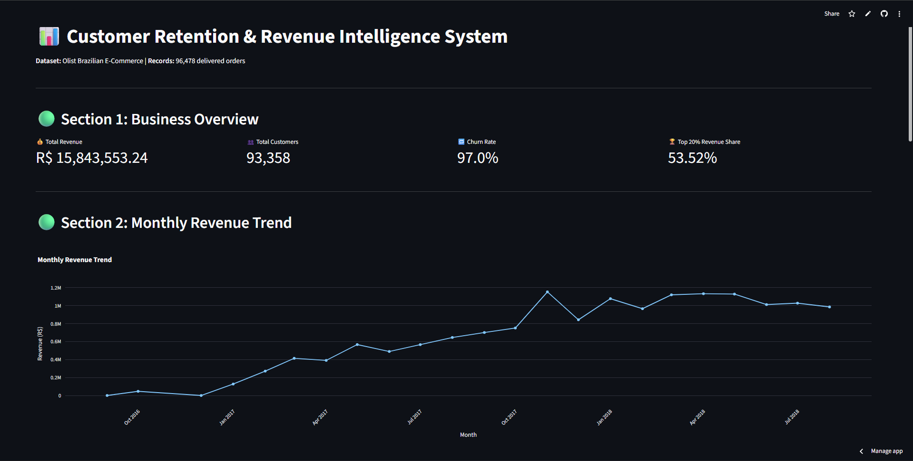

# 📊 Customer Retention & Revenue Intelligence System

🚨 **97% of customers never return after their first purchase — making retention the biggest revenue bottleneck.**

This project analyzes customer behavior across 96K+ transactions to identify why customers churn, where revenue is concentrated, and how businesses can improve retention and growth.

🌐 **Live Demo:** [customer-retention-intelligence.streamlit.app](https://customer-retention-intelligence.streamlit.app)



---

## 🎯 Objective

Build a data system to:
- Analyze customer purchase behavior
- Identify revenue concentration patterns
- Detect churn and retention failures
- Generate actionable business strategies

---

## 🗂️ Dataset

| Field | Details |
|---|---|
| Source | [Olist Brazilian E-Commerce Dataset](https://www.kaggle.com/datasets/olistbr/brazilian-ecommerce) (Kaggle) |
| Orders | 96,478 delivered orders |
| Customers | 93,358 unique customers |
| Period | October 2016 – August 2018 |

---

## 🛠️ Tech Stack

- **Python** — data cleaning, analysis, segmentation
- **SQLite** — relational database with 4 normalized tables
- **SQL** — revenue analysis, cohort analysis, window functions, CTEs
- **Pandas & NumPy** — data manipulation and retention calculations
- **Plotly** — interactive charts and cohort heatmap
- **Streamlit** — web dashboard

---

## 🧱 Database Design

Four normalized tables built from raw CSVs:

- `customers` — unique customer IDs and state
- `orders` — order ID, customer ID, order date
- `order_items` — product, quantity, unit price, total price
- `products` — product ID and category

---

## 🔥 SQL Analysis

Queries written against SQLite covering:

- Total revenue aggregation
- Monthly revenue trend
- Repeat vs one-time customer segmentation
- Customer Lifetime Value (CLV)
- Top customer revenue contribution using **window functions**
- **Cohort analysis** using CTEs to track retention month-over-month
- Product category performance

---

## 📊 Key Business Insights

| Metric | Value |
|---|---|
| Total Revenue | R$ 15,843,553.24 |
| Total Unique Customers | 93,358 |
| Repeat Customers | 2,801 |
| Churn Rate | 97.0% |
| Top 20% Customer Revenue Share | 53.52% |
| High Segment Revenue Share | 67.8% |

- 📉 **97% of customers churn after first purchase** → critical retention failure
- 🏆 **Top 20% of customers generate 53.5% of revenue** → heavy dependency on a small segment
- 📊 **High-value segment contributes 67.8% of revenue** → must be protected at all costs
- 📆 **Retention drops sharply after Month 1** → onboarding and engagement breakdown
- 📦 **Health & Beauty drives highest revenue** → strongest monetization category at R$ 1.44M

---

## 💡 Business Recommendations

- 🎯 **Retain top 20% customers** → protects over 50% of total revenue
- 📧 **Improve post-purchase engagement** → directly addresses 97% churn bottleneck
- 🛍️ **Cross-sell Health & Beauty with Watches & Gifts** → increase average order value
- 📊 **Fix first-month retention experience** → biggest drop-off window across all cohorts
- 💳 **Upsell Mid-value customers with bundles** → easiest path to expanding high-value segment

---

## ⚡ Business Impact

If implemented, these strategies can:
- Reduce churn significantly from the current 97% baseline
- Increase repeat purchase rate beyond the current 3%
- Improve customer lifetime value across all segments
- Reduce revenue dependency on the top 20% customer concentration

---

## 🚀 Run Locally

```bash
# Clone the repo
git clone https://github.com/ChiragSharma2026/customer-retention-intelligence

# Install dependencies
pip install -r requirements.txt

# Build the database
python loader.py

# Launch the dashboard
streamlit run app.py
```

---

## 📁 Project Structure
customer-retention-intelligence/
├── archive/               # Raw Olist CSV files
├── loader.py              # Data cleaning + SQLite ingestion
├── queries.py             # SQL analysis queries
├── analysis.py            # Segmentation + retention calculations
├── app.py                 # Streamlit dashboard
├── requirements.txt       # Python dependencies
└── README.md
---

## 📌 Resume Bullet

> Built a customer retention analytics system analyzing 96K+ transactions across 93K customers using SQL (CTEs, window functions, cohort analysis), Python, and Streamlit; identified 97% first-purchase churn rate and that top 20% of customers drive 53.52% of revenue, enabling targeted retention strategies. Deployed live on Streamlit Cloud.
